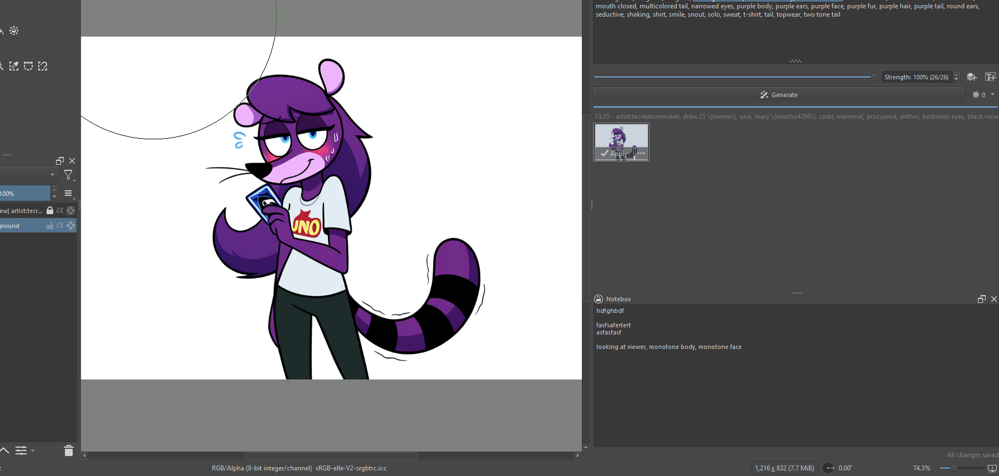

# Notebox
A simple persistent notepad docker for Krita. Perfect for keeping track of color codes, layer names, to-do lists, or any other notes you need while working. Unlike temporary notes, Notebox automatically saves your text and preserves it between Krita sessions.

# Features
- Automatically saves your notes as you type
- Notes persist between Krita sessions
- Simple, clean interface
- Visible save status indicator
- Takes up minimal space in your workspace
- Zero configuration needed

# Installation
Step 1: Download the file from either 'releases' or from the code tab to the upper left (hit 'download zip' at the bottom)   

**AUTOMATIC**  
Step 2: Tools > Scripts > Import Python Plugin from File  
Step 3: Select your .zip file  
Step 4: Restart Krita  
Step 5: (If docker isn't visible) Settings > Dockers > Notebox  

**MANUAL**    
Step 2: Settings > Manage Resources  
Step 3: Hit 'Open Resource Folder' in the bottom right to open your resources library  
Step 4: Unzip your .zip into the 'pykrita' folder  
Step 5: Settings > Configure Krita, then 'Python Plugin Manager' at the bottom of the list of tabs  
Step 6: Enable Notebox  
Step 7: Restart Krita  
Step 8: (If docker isn't visible) Settings > Dockers > Notebox  

# How to Use
The plugin is designed to be simple and stay out of your way:

- Type your notes in the text box
- Changes are saved automatically after 1 second of inactivity
- The save status is shown at the bottom of the docker
- Your notes will still be there next time you open Krita

Since the docker uses Krita's built-in settings system to store your notes, they will persist between sessions without cluttering your hard drive with separate files.
